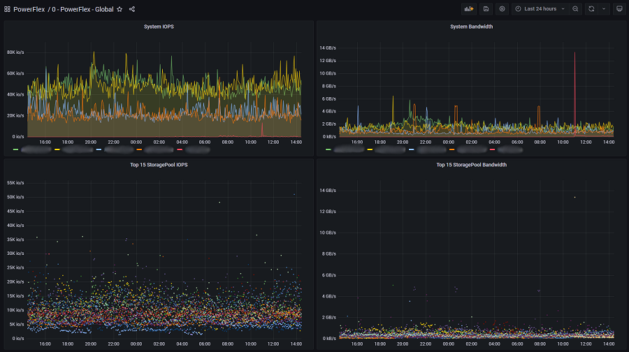
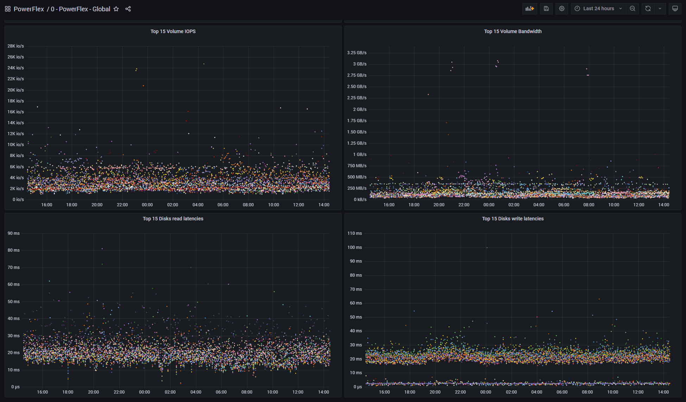
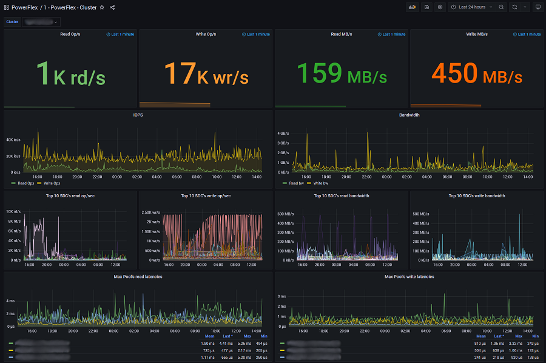
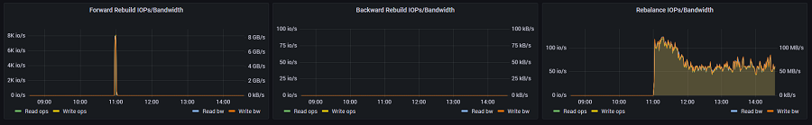
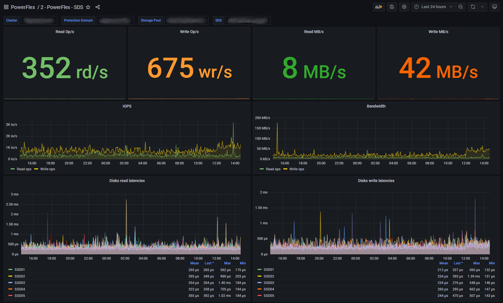
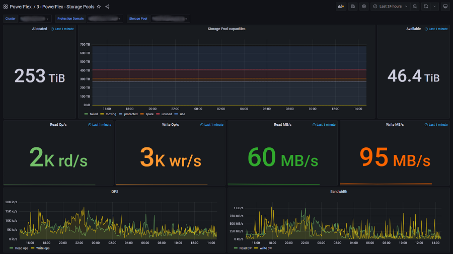
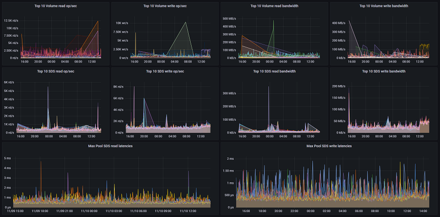
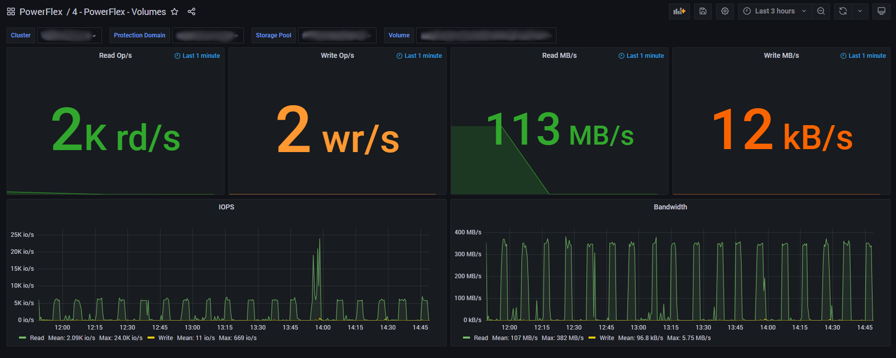
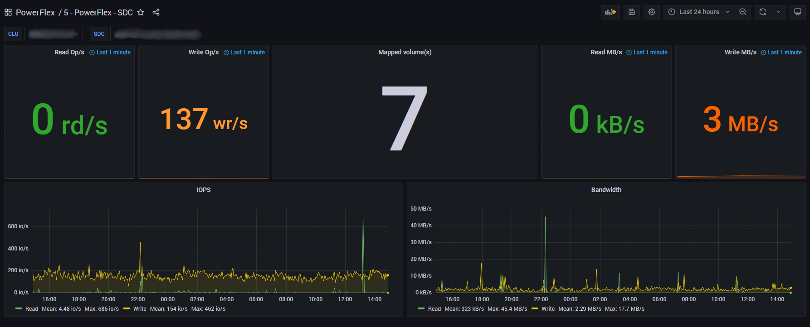

## ScaleIO / VxFlex / PowerFlex Prometheus Exporter

## Functionality

 Exposes all the selected [ScaleIO / VxFlex / PowerFlex](https://en.wikipedia.org/wiki/Dell_EMC_ScaleIO) statistics to a [Prometheus](https://prometheus.io/) endpoint

## Features

- 100% [Rust](http://rust-lang.org/)
- User definable statistics via `metric_query_selection.json` see [REST API Reference Guide](https://docs.delltechnologies.com/bundle/PF_REST_API_RG)
- [Prometheus](https://prometheus.io/) customizable metric naming via `metric_definition.json`

### Grafana Dashboards examples
_Grafana version 8+ required_

**Global**  
  

**Cluster**  
  
  

**SDS**  
  

**Storage Pools**  
  
  

**Volumes**  
  

**SDC**  
  

## Usage (Docker)

    # Default settings
    docker run -d --name sio2prom -h sio2prom -e IP=1.1.1.1 -e AUTH_USR=mon -e AUTH_PWD=mon -p 8080:8080 syepes/sio2prom

    # Custom / local configuration files: $PWD/cfgmetric_definition.json  $PWD/cfg/metric_query_selection.json
    docker run -d --name sio2prom -h sio2prom -e IP=1.1.1.1 -e AUTH_USR=mon -e AUTH_PWD=mon -v $PWD/cfg:/app/cfg/ -p 8080:8080 syepes/sio2prom

    # Metrics
    curl -v -i http://localhost:8080/metrics

## Usage (Built from src)

    git clone https://github.com/syepes/sio2prom.git && cd sio2prom
    cargo build --release (nightly)
    target/*/release/sio2prom --help

## Exposed labels

    System:           {clu_id="", clu_name=""}
    Sdr:              {clu_id="", clu_name="", sdr_id="", sdr_name=""}
    Sdc:              {clu_id="", clu_name="", sdc_id="", sdc_name=""}
    ProtectionDomain: {clu_id="", clu_name="", pdo_id="", pdo_name=""}
    Sds:              {clu_id="", clu_name="", pdo_id="", pdo_name="", sds_id="", sds_name=""}
    StoragePool:      {clu_id="", clu_name="", pdo_id="", pdo_name="", sto_id="", sto_name=""}
    Volume:           {clu_id="", clu_name="", pdo_id="", pdo_name="", sto_id="", sto_name="", vol_id="", vol_name=""}
    Device:           {clu_id="", clu_name="", pdo_id="", pdo_name="", sto_id="", sto_name="", sds_id="", sds_name="", dev_id="", dev_name="", dev_path=""}
